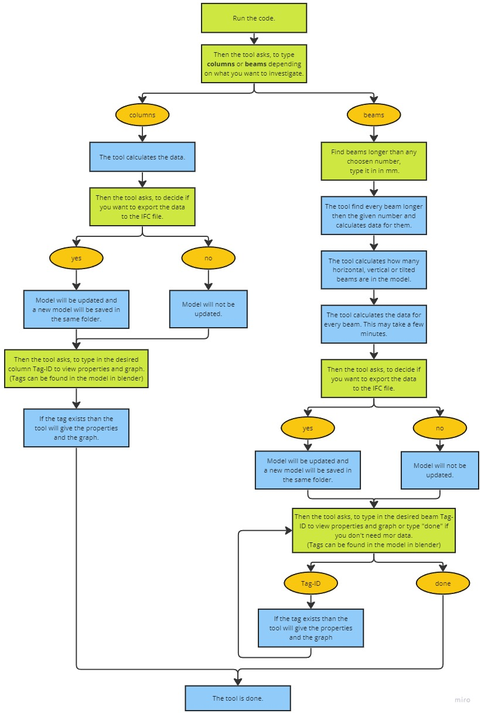

<h1 style="text-align: center;">Advanced BIM A4: OpenBIM Champion</h1>
<h4 style="text-align: center;">
Group 37    

Niclas Brandt - s230346     
Adria Flóra Kerekes - s232453
</h4>

## Before using the tool
Before using the tool, the architect needs to create the 3D model and hand in an IFC4 model for the tool. This model can be an early concept design of the building, but it should contain every column and beam that are needed according to the early plans. The description of the beams needs to contain the section type of the beam (like IPE 200).

## Setting up
A person with background as a structural engineer or architect is needed to operate the tool and interpret results correctly. 
The IFC4 model must be in the same folder as the code. The name of the IFC model has to be put in to the code in line 44. 
The packages that are written in the beginning of the code must be installed for the code to run successfully.

## Using the tool

### Video tutorials

- [Video Tutorial #1](https://youtu.be/-f-GhZUr8rw)

- [Video Tutorial #2](https://youtu.be/n6Jy4n5D0Nw)

- [Video Tutorial #3](https://youtu.be/Yd561s5rfrQ)

# Explanation of python code

## Code analyzing beams
The code is using the LLYN - STRU.ifc model (Skylab structural model). 

The goal is to get the geometrical data of the beams in the model. This includes span of the beam, and for the section: area, thickness, Iy and Iz. From this data it is possible to calculate the strength of the beam. 

First it opens the IFC model which is needed for the use case. Then it identifies all the beams in the category ‘IfcBeams’ in the model. The geometrical data of the beams will be put in two dictionaries, one with all the different spans of the individual beams and one with all the beam types based on the different sections. 

We get the total number of beams in the model. The user can also get the number of the beams longer than any span chosen by the user. The span needs to be given in mm. We also get a list about the beams longer than the given number with their ID, span and material.  

The beam dictionary is created containing every beam identified by their unique ID from the IFC model. The dictionary contains the spans and the description. The description in the model has the beam types in it (like IPE160 or HE200B). This is very important, because these are specific beam types, and the geometry of the section is available in different databases. 

In the IFC model there are horizontal, vertical and tilted beams. We get the number of them using the slope and roll properties of the beams. If the slope is bigger, than 0 it is a tilted beam, if the roll equals 90 it is a vertical beam and if both the slope and the roll property equal 0 it is a horizontal beam. 

Since the types of the different beams are regulated and available in databases, it is possible to use for example a website to get the needed geometrical data. The website used here: https://www.dlubal.com/en. For getting the data we need the exact url of the different beam types. The url of every general type, like IPE or HEB has a specific ending which is put into a dictionary. To get the part of the url which is specific to every different beam type we need to get the description of the beams and modify it to fit the url, like make it lower case and delete the unnecessary part. For example, from ‘Firkantet rør, SHS150x8’ we need ‘shs-150x8’. 

This is done with the “get_url_from_description” function. The function goes trough every beam’s description and in the string finds the beam type code based on rules that are specific to these beams but works for every beam in this IFC model. First it finds every capital letter which is not followed by any lower case letters, so we get the HE or SHS part for example. Then it finds every number and the letter ‘x’ after that, so we get HE240 or SHS80x5. Then we need the rest of the capital letters to get HE240B for example. Then we make it into lower case and join the letters and numbers with a ‘-‘, because in the url of the website we use it is like that. The ‘key’ parameter also gets defined here which is just the letters of the beam type code, so for example for ‘he240b’ it is ‘heb’. These keys will be used for the url ending dictionary to get the right ending of every url. 

After getting the right url for the different beam types the website is opened and searched for the specified data which are the area, thickness, Iy and Iz. If other data is also needed later, it is possible to add that as well. 

This is done with the “get_data_from_web” function. On the website there is a name for every data type, for example the area of the section is called "Sectional area". Using these names, the code is able to find the data on the website if it exists. (When the section of the beam is a square Iz = Iy so Iz doesn’t exist on the website. In this case Iz will be defined by being equal to Iy.)

This data is then put into a dictionary. Since a lot of beams have the same type and thus the same sectional geometry, we do not go through every beam here, only every type of beam. So, for example if we already have the data for IPE200 and there is another beam from this type, the data is simply copied from the first IPE200 beam. This makes the code much faster since opening the website and getting the necessary data takes non negligible time. 

There are some unique beams in the IFC model, which has the description ‘Opsvejst I-profil’. We can’t get the data of these beams because they do not exist in the database we use. For these beams unique calculations are needed in the future. 

The result is that the user can choose any beam, specified with its ID and get all the data sored in the libraries. Also a 3D image of the chosen beam will appear in the browser. One example:

Give the ID of the beam you would like the data of: 1803694\
Span = 11420.0 mm\
Type: Stålgitter_HE160B\
Area = 54.25 cm2\
Thickness = 8.0 mm\
Iy = 2492.0 cm4\
Iz = 889.2 cm4

## Code analyzing columns 
The code is using the LLYN - STRU.ifc model (Skylab structural model). 

In comparison to the API based approach of fetching the cross-section data from a website, the graph-based approach takes the vertices of an IFC element and draws the cross-section in a graph, wherefrom the geometrical properties are calculated in the script. Starting the script all column types are listed and counted to get an overview over all columns present in the model. Afterwards the vertices of each column are extracted using ifcopenshell and further processed. As we only want the vertices representing the 2D cross-section we remove the other halft to go from 3D to 2D. They still have the coordinates from their original location. Therefore the coordinates for each section are normalized so the sections left bottom corner always starts at 0,0 making the graph more nice to look at and it is easier to read the width of the section. The next step will be to sort the vertices based on polar angles to ensure for a robust calculation of the geometric properties which is dependent on the order of the vertices. This is because the vertices can start at different indices when they come as output from icfopenshell. Sorting based on polar angles from the center is a robust way to get them in the same order everytime for every cross-section. Furthermore, the script separates between different cross-section types as the number of vertices for each cross-section differ. These vertices are then used to calculate the Area which is done with the so called "shoelace-formula" (Can be found under the defined formulas in the start of the script). Furthermore cross-section measurements like height and width are calculated and based on these the Iz and Iy are calculated. Spans are also present in the dictionary.

During this process all the calculated geometric cross-section properties are stored in a dictionary called "properties" that will make it easy to access the data. This dictionary is used to transfer all the data to the ifc file in order to update the property sets of the columns. The key of the dictionary is the unique ID whereas the values are all the calculated cross-section properties. This means that every unique ID is linked to a list of calculated cross-section properties. 

This data structure will make it very easy to access the desired data just by using the ID of the column you want to investigate. This is done in the last part of the code where the user can input an ID whereafter a graph and 3D model will pop up in the browser with all the geometric properties from the chosen column. The graphical representation of the 2D cross-section is done with "bokeh" and uses the vertices extracted at the start of the code after they have been normalized. The normalization will make that each cross-section starts in 0,0 in the graphical representation so the width and height can be read from the graph axis. A line is then drawn in the craph to visualize the boundary and connect the edge points. 

