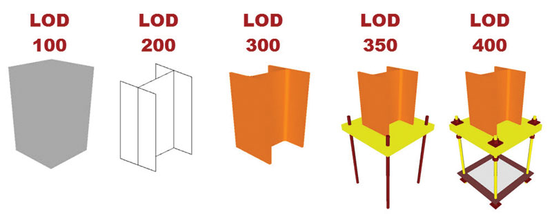

<h1 style="text-align: center;">Advanced BIM A3: OpenBIM Analysis</h1>
<h4 style="text-align: center;">
Group 37    

Niclas Brandt - s230346     
Adria Flóra Kerekes - s232453
</h4>

## Goal
The goal of the tool is to support the engineer to make an early and quick analysis just by using the IFC model handed over from the architect. This should enhance the workflow and make communication quicker and easier between two parties. Thus the main goal is to perform structural analysis based on a IFC model where the goal of our code is to enrich the IFC model with all needed geometric cross-section data to perform this analysis. 

## Mapping BIM uses, use cases and processes
The use case focuses on the Structural Analysis of the building or project given by the architect. This is a forecast analysis as it happens in the beginning of the design phase. 

## Model uses
The whole tool is supposed to perform preliminary structural analysis based on an IFC model that comes from the architect. 
To achieve this the whole code must do the following:
- Calculate cross-section data based on 3D geometry (our delievered tool). 
- Calculate load distribution.
- Identify connecting elements for each element to define support conditions.

This should help performing a fast and early analysis to identify major structural problems at an early stage and smoothen the communication process as a lot of time is saved and no one has to wait a long time for an asnwer. This means the tool will mainly be used by the structural engineer but it could also be used by architects to get a broad overview of, if a structure is stable or not. This relates to our goal of making an early stage structural analysis to enable a fast and smooth communication and basis for early decision making as well as identifying structural problems early. 

## Process
Before using the tool, the architect needs to create the 3D model and hand in an IFC model for the tool. This model can bean early concept design of the building, but it should contain every column and beam that are needed according to the early plans. The general goal of the tool is to then help the structural engineer to check if these columns and beams are fitting for the loads of the building. After the tool was used and the calculations were made confirming if the columns and beams are correct or not, the structural engineer must check if the data is reasonable. This is needed because in some cases for example concrete can behave differently if the load reaches a certain amount. If the tool declares that some columns or beams are not correct, they need to be changed and then checked again. This is an iteration process which continues until every column and beam fits the loads. When this state is reached the architect gets the data back from the structural engineer in the form of an updated IFC file. 

The architect can continue designing the building now having the right size and type for the columns and beams. Later if something changes in the design new calculations are needed. 

This way the architect can have more accurate data about the structure faster than without this tool. This helps with the design because they will not need to make significant changes in the plan if in a later phase the structural engineer figures out that some columns or beams are not good enough. 

## Information exchange
The main delivery of information is in the start where the engineer gets the 3D-model (IFC) from the architect. For the tool to be able to work properly this model needs to be in LOD 300 as all beams and columns have to be represented as 3-dimensional shapes. 

Before performing the analysis the model is updated with all this information (cross-section data, load-data, support data), thus the model reaches LOD 350 before starting the structural analysis. 

## Infrastructure
The needed infrastructure to ensure for a smooth project workflow splits up in following topics:

- Technology: Both parties need a computer as well as the necessary software to build and process IFC models and internet access. Furthermore python is required. Furthermore a platform is needed to exchange IFC models where the type of the platform should be agreed on before the start of the project. 

- Contracts: For clear expectations on deliveries it is inevitable to have contracts that state the LOD of each model delivery as well as what non-graphical information the model has to contain. Same goes for the engineer on what exactly the tool has to update the model with. Furthermore the contract should state that all the engineers calculations are preliminary and not ready for construction. 

- Human ressources: A person with background as a structural engineer or architect is needed to operate the tool and interpret results correctly.

## Improvement
Designing a new tool we strive for that it will give improvement for a workflow that normally takes a lot of time. First of all our tool makes it very fast and easy to calculate all geometric cross-section data based on the 3D-model and afterwards enrich the IFC model with this data to then perform a structural analysis. Furthermore it will contribute to a more clear and efficient communication between the engineer and the architect as the engineer now has the possibility to quickly perform a preliminary structural analysis informing the architect about major problems. These problem areas can now be detected earlier and thereby, it makes the design process a lot smoother. 

## Reflect

We extended our previous tool with putting the data into the IFC model. We also added this step in the BPMN diagram. 

What we did in assignment 2 already fulfilled a major part of our goal, so we only needed to add a few additional lines of code. Thus we could extend our previous tool very easily. 

## BIM use case
The use case is for the structural engineer to extract all geometrical properties of the beams and make an early-stage analysis of single beams or columns. After calculating the geometrical properties as well as performing the early-stage analysis the data is stored in a dictionary to put it back into the IFC file. This should help dimensioning beams and columns early in the design phase and also enriching the IFC with structural data to later on make it easy to perform a detailed FE-analysis. This should enhance the collaboration between architect and structural engineer in one model. Even if the architect places beams in the model without any more information the script will automatically calculate all cross-section properties and perform a stress check. 

To achieve the functionality we wanted we used programming in python as well as structural engineering expertise. We were mainly interested in beams and columns. We used engineering analysis.

In our script we used the IFC-Beams as well as IFC-Columns concepts and the property sets. Furthermore we used the IFC-Beam-Type and the IFC-Column-Type. The input data for our use case is the IFC model itself with data about columns as well as beams and their section type and material. 

Before our use case can start the IFC model needs to be modelled by the architect. The next use case would be the detailed FE analysis as well as the architect that are waiting for the changes or results of our use case. Between the architect and our use case it is an iterational process which makes the architect also waiting for our use case.

## Python code for updating IFC file
In assignment 2 we created a script that calculates the geometrical cross-section properties of beams and columns and stores the data in a dictionary. For this assignment we will use the same script to use this stored data and export it into the IFC file by adding some code that accesses the dictionary with the properties. First the new code will add a property-set (pset) to every column and beam whereafter this property-set is edited and the data from the dictionary added to the new property-set. When the property-set of all columns and beams is updated the file will be saved. The new file will pop up in the same folder as the original file and the script. The approach is the same for both beams and columns.

## Limitations of the code

- The IFC4 model has to be in the same folder as the code. 
- The name of the IFC model needs to be changed if another model is used in the tool. 
- The description of the beams needs to contain the section type of the beam (like IPE 200). 
- Code has to be revised if new custom sections are added. 

